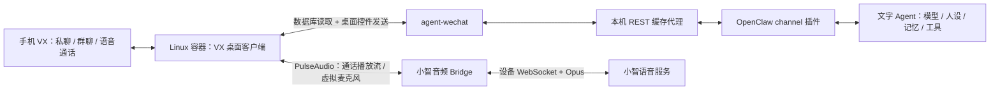

# vx agent接入

把一个长期登录的 **VX 个人号** 接入 AI Agent：基础版支持私聊、群聊文字回复；进阶版在真实 VX 语音通话中与语音智能体对话。

这是一份从实际部署整理出的**实现流程参考**，附连接代码、配置样例、测试和故障边界。不是官方机器人接口，不是企业账号方案，也不是一键安装包。

## 能实现什么

| 场景 | 实现方式 | 前提与边界 |
| --- | --- | --- |
| 私聊 AI 助手 | 指定联系人发消息，OpenClaw 处理后回复 | 私聊白名单；模型、角色、记忆由 OpenClaw 管理 |
| 群内问答 | 在指定群里 `@` 机器人，回复问题 | 群白名单；默认需要 mention |
| 群内低频主动发言 | 可选观察器判断是否参与聊天 | 初次部署建议关闭；有冷却和每日次数上限 |
| 图片、文件与工具 | 通过文字 Agent 处理媒体或调用工具 | 依赖所选模型、插件和权限，需分别验收 |
| 语音接听 | 成员拨打机器人，接听后转发双向音频 | 当前来电窗口不能可靠区分群；不保证按群限制接听 |
| 文字指令拨号 | 在可信群里让机器人发起群通话 | 需配置目标群、成员映射及 Agent 调用权限 |
| 语音角色聊天 | 当前由小智后台设置角色、语言和声音 | 文字与语音上下文独立，不天然共享群聊记忆 |

当前语音后端是**小智**，不是 ChatGPT 网页 Voice。曾经实现过的
**Codex CLI Realtime / GPT Voice** 保留在 [Codex Voice 归档](archive/codex-voice/README.md)，可研究，但不作为当前默认安装路径。

## 所需设备

| 项目 | 需求 |
| --- | --- |
| 长期开机主机 | Linux，建议 Debian/Ubuntu/Armbian 类 systemd 环境；已有 ARM64 Armbian 实机记录 |
| 架构与资源 | Linux VX 包、容器和依赖必须匹配 CPU 架构；4 GB 内存是规划下限，建议 8 GB 或更多，非最低配置保证 |
| 存储 | 为容器、账号数据、Agent 会话和备份预留持久存储；建议从 20 GB 可用空间规划 |
| 容器环境 | Docker、Compose；容器内运行图形桌面、AT-SPI 和 PulseAudio |
| 账号 | 可扫码登录的 VX 个人号；文字模型服务凭据；语音版另需绑定一个小智虚拟设备 |
| 网络 | 主机需持续访问 VX、文字模型、软件源及语音服务；访问不到的服务需可用代理 |
| 测试端 | 手机上的 VX，用于真实私聊、群聊和通话验收 |
| 管理方式 | SSH，以及登录或异常处理时可用的私有桌面访问方式 |

不需要专门的小智硬件、实体麦克风或音箱：语音通过容器内虚拟音频设备转发。
完整部署在 Linux 后，Mac 不参与运行，可以关机。

详细条件与网络检查见 [设备与网络](docs/device-and-network.md)。以上资源数值是部署规划建议，不是已经验证的性能门槛。

## 核心架构



关键参考是 [thisnick/agent-wechat](https://github.com/thisnick/agent-wechat)：
它把 Linux VX 桌面端接成 REST/media API。读取消息主要走数据库；
打开聊天、发送、拨号和接听仍涉及桌面控件，不是纯后台协议机器人。

本项目在此之上连接 OpenClaw 文字 Agent，并把通话音频转给小智。
当前小智链路不需要 Codex CLI、Codex 桌面版或 WebRTC；这些属于归档中的旧 GPT Voice 后端。

## 实现流程

按下面顺序逐层搭建，每一步都通过再继续：

1. **准备 Linux 与网络**：确认架构、Docker、持久存储和各服务网络可达。
2. **运行 VX 客户端**：参考 agent-wechat 上游部署容器，扫码登录，验证真实认证和非空聊天列表。
3. **单独跑通 OpenClaw**：配置模型与角色，先确认文字 Agent 自身可回复。
4. **接入文字 channel**：安装 `@agent-wechat/wechat`，配置本机 API、token、私聊/群白名单和 mention 规则。
5. **真实文字验收**：手机发私聊、群内 `@` 后收到回复，再验证容器重启后的恢复。
6. **按需增加小智语音**：注册一个虚拟设备，分别验证设备建链、音频采集和虚拟麦克风注入。
7. **接入通话控制**：先手动通话验证双向音频，再启用自动接听及文字指令拨号。
8. **长期观察与回退**：确认挂断清理、登录态持久化和真实重启恢复，保留匹配的镜像、二进制与数据卷。

基础文字步骤见 [基础文字部署](docs/basic-deployment.md)，语音步骤见
[小智语音接入](docs/voice-deployment.md)，原理和故障边界见
[系统原理](docs/how-it-works.md)。

```bash
git clone https://github.com/wan7up/vx-agent-access.git
cd vx-agent-access
```

`scripts/configure-env.sh`、
`scripts/install-services.sh` 只配置本项目辅助程序，不安装或登录 VX，
不安装 OpenClaw，也不自动配置小智。先阅读指南，不要直接把现网配置覆盖到新机器。

## 文档与代码

| 入口 | 内容 |
| --- | --- |
| [设备与网络](docs/device-and-network.md) | 主机、账号、代理、端口和联网条件 |
| [基础文字部署](docs/basic-deployment.md) | VX 容器、OpenClaw、白名单和真实收发验证 |
| [小智语音接入](docs/voice-deployment.md) | 虚拟设备、音频桥接、来电/拨号和验收顺序 |
| [系统原理](docs/how-it-works.md) | 数据库、桌面自动化、Agent 与两种语音后端的职责 |
| [项目范围](docs/project-positioning.md) | 能力、限制与适用场景 |
| [兼容性与回退](docs/compatibility-and-recovery.md) | 已验证范围、已知风险、验收与回退原则 |
| [仓库整合记录](docs/repository-consolidation.md) | 两个旧仓库与统一仓库的关系 |
| [Codex Voice 归档](archive/codex-voice/README.md) | 历史 GPT Voice / WebRTC 实现与资料 |

`components/` 是当前小智 Bridge 和共享音频模块；`services/` 是缓存、
观察器和会话维护；`deploy/` 是部署参考；`tests/` 是回归测试。
`deploy/desktop-rebuild/` 是桌面环境重建参考，需要自行提供匹配的基础镜像、
二进制和数据卷，**不是供新主机直接执行的 Compose**。

公开源码基线：`vx-agent-access-20261007-r5`。2026 年 10 月 7 日已有
私聊、群聊和小智双向通话实测；长期稳定性仍需观察。公开整理不改变已有部署。

## 安全与限制

- 非 VX、OpenClaw、小智或 OpenAI 官方项目；账号自动化存在兼容性和账号风险。
- 只在自己控制并获得参与者同意的账号、联系人和群中使用。
- API 与缓存只监听 loopback，不公开暴露控制接口。
- token、登录态、设备身份、聊天记录和备份不提交 Git；私有仓库也不能代替凭据保护。
- 文字与语音会把相应内容送至各自的云服务，需理解所选服务的隐私与数据政策。
- 同时只允许一通语音；自动接听无法可靠按群分流，首次部署应使用专门测试号。
- 读取成功、服务 active 或 WebSocket 在线都不等于可用，必须验收真实收发和双向音频。
- 上游客户端、插件或 API 升级前先备份并重新验收；不要混搭不同数据库版本的二进制和数据卷。

本仓库自行编写的代码和文档采用 [MIT License](LICENSE)。第三方组件遵循各自许可与服务条款。
