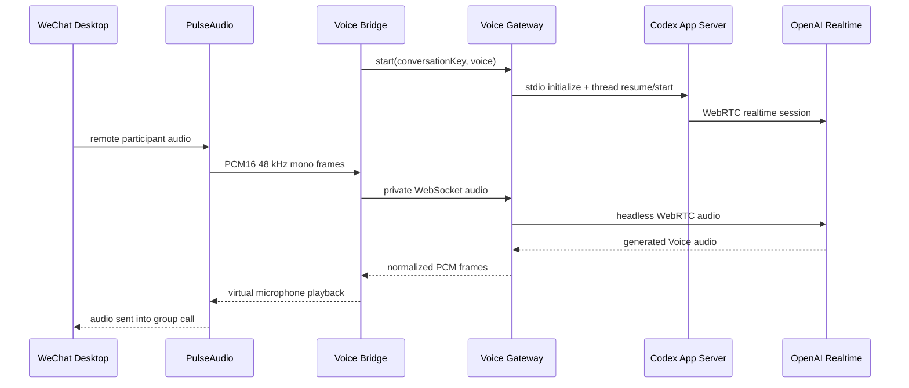

# GPT Voice 链路参考

本页是旧 Codex Voice 的历史部署参考，当前生产使用小智，不按本页启用服务。
整体原理见[系统原理与实现路径](../../../docs/how-it-works.md)，
当前操作见[小智语音链路](../../../docs/voice-deployment.md)。

Voice 版在基础文字链路之外增加一条独立实时音频链路。OpenClaw 仍负责人设、记忆和文字回复；Codex Realtime 只处理 vx 语音通话。

> 当前状态：已在 Linux ARM64 主机完成主动外呼、自动接听和连续全双工实测。Codex App Server Realtime 是实验接口，本项目将其作为工程参考和可修改的实现交付，不把跨版本一键部署作为目标。

## 架构



所有服务运行在同一台 Linux 主机时：

- Gateway 监听 `127.0.0.1`。
- Bridge 通过本机私有 WebSocket 连接 Gateway。
- Codex App Server 只通过 `stdio` 启动，不监听网络端口。
- 原始音频、SDP、ticket 和登录凭据不落盘。

## 组件

| 组件 | 作用 |
| --- | --- |
| Codex Voice Gateway | 管理独立 `CODEX_HOME`、Codex thread、App Server JSON-RPC 和 WebRTC |
| WeChat GPT Voice Bridge | 在 PulseAudio 与 Gateway 之间转发实时 PCM 音频 |
| `wechat-group-call` | 受控打开群通话、选择成员、写入首句请求并预热 Bridge |
| incoming-call observer | 识别 AT-SPI `Answer` 控件、预热并自动接听 |
| PulseAudio launch wrapper | 创建 vx 播放、注入和虚拟麦克风端点 |

源码已归入本仓库：

- [Codex Voice Gateway](../components/codex-voice-gateway)
- [WeChat GPT Voice Bridge](../components/wechat-gpt-voice-bridge)

正式发布仍需为两者补齐统一安装器、固定 Codex/Node/Python 版本和干净主机回归。

安装主仓库的 Voice 辅助脚本时必须显式选择 profile：

```bash
sudo scripts/install-services.sh --profile voice
```

默认不传参数等同于 `--profile basic`，不会安装自动接听或通话辅助脚本。Gateway 与 Bridge 仍需分别按照组件目录中的 README 安装。

## 前置条件

- 基础版文字链路已连续稳定运行。
- Linux vx 能正常发起和接收群语音通话。
- PulseAudio 可在 vx 容器内创建虚拟 sink/source。
- Node.js 24、Python 3.11+、systemd 和 Docker。
- Linux 架构对应的 Codex CLI 固定版本。
- 一个具有 Voice 权限的官方 Codex/ChatGPT 账号。
- 主机能够稳定访问 OpenAI；如需代理，应先单独验证 WebRTC/TCP 路径。

不要让 Voice Gateway 继承 Codex++、自定义 Base URL 或第三方 provider 环境变量。

## 独立 Codex 环境

为 Voice 创建独立目录，例如：

```bash
sudo install -d -m 700 -o root -g root /var/lib/codex-voice-gateway/codex-home
sudo env CODEX_HOME=/var/lib/codex-voice-gateway/codex-home \
  /opt/codex-voice/bin/codex login --device-auth
```

Gateway 子进程必须清除外接 API key、Base URL 和 provider 环境变量。升级 Codex 前：

1. 记录旧版本。
2. 生成 App Server TypeScript/JSON schema。
3. 检查 `realtime_conversation` feature。
4. 重跑 Gateway 测试、建链、首句、审批和真实通话回归。

## 会话模型

- 每个群使用稳定 `conversationKey`，例如 `wechat:group:<chatroom-id>`。
- Gateway SQLite 保存 external key 到 Codex thread 的映射。
- 每通电话创建新的 Realtime/WebRTC 连接，但恢复该群固定 thread。
- thread 可能随历史增长而压缩；不要把原始音频作为记忆存储。
- 自动接听无法从当前 Linux vx 弹窗可靠识别群名时，应固定使用一个配置的默认 conversation key。

## 主动外呼

OpenClaw 只在可信群收到明确拨号请求后调用：

```bash
wechat-group-call '<member-alias>' \
  --expected-chat-id '<group-id>@chatroom' \
  --gpt-voice \
  --voice-opening-local-id '<message-local-id>'
```

安全约束：

- 真实外呼必须要求 `--expected-chat-id`。
- 群映射和成员别名来自私有配置，不写死在公共源码。
- 使用 `/run/lock/wechat-group-call.lock` 串行化 GUI 操作。
- 已有 Bridge 激活时拒绝第二通。
- 拨号失败只停止本次新建 Bridge。

## 自动接听

自动接听不使用截图识别。容器内轻量探针读取 Linux AT-SPI 无障碍树，查找准确的 `push-button "Answer"`：

1. 发现来电并取得按钮位置。
2. 启动 Bridge，给 Realtime 留出短暂预热时间。
3. 再次确认 `Answer` 仍存在并取得最新位置。
4. 点击接听；若来电已结束则停止本次 Bridge，不点击旧坐标。

这依赖 vx 当前暴露的英文控件名称。vx 升级后找不到控件时应失败关闭。

## PulseAudio 约定

参考实现使用：

```text
wechat_call_playback    vx 远端声音的隔离播放 sink
gpt_voice_inject        GPT 输出注入 sink
gpt_voice_mic           基于 inject monitor 的 vx 虚拟麦克风
```

Bridge 在通话流出现后动态识别 WeChat sink-input/source-output，搬移到上述端点，并在挂断后恢复原设备。vx 可能临时更换流 ID，因此初次路由和通话中均需重新发现与重试。

## 分阶段验收

1. **Codex spike**：本机浏览器或 headless WebRTC 完成一次真实双向音频。
2. **Pulse loop**：确认 vx 播放可被捕获、虚拟麦克风可送入 vx。
3. **手动通话**：Bridge 在已接通电话中连续完成三轮对话。
4. **主动外呼**：文字指令触发、首句正确、挂断清理。
5. **自动接听**：来电预热、接听、通用首句、双向对话。
6. **稳定性**：连续多通、10 分钟通话、网络波动、服务重启。

每一步成功后建立 root-only 快照；不要在真实通话进行中部署 Gateway、Bridge、Pulse 或通话脚本。

## 已知风险

- Codex Realtime schema、voice 列表和事件名称可能随 CLI 升级变化。
- Linux vx、AT-SPI 和 PulseAudio 流 ID 不是稳定公共 API。
- 代理网络可能使 WebRTC 建链变慢或失败。
- 自动接听若不做群识别，会接听该测试账号收到的所有语音来电。
- vx 账号自动化可能触发平台限制；不要用于陌生人或大规模运营。
