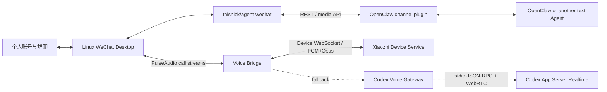

# 系统原理与实现路径

“vx agent接入”不是一套独立完成所有工作的机器人框架。它记录的是如何把若干已有能力组合成一个长期运行的个人 Agent 渠道，并提供已经实测过的连接代码、配置样例和故障边界。

## 三层结构



这三层可以分开理解和替换：

1. **个人渠道层**负责保持真实账号登录，并把原本只存在于桌面客户端中的消息和通话音频暴露给本机程序。
2. **文字 Agent 层**负责消息轮询、会话、人设、记忆、工具和文字/媒体回复。
3. **Realtime Voice 层**负责低延迟双向音频，不依赖文字 Agent 的语音识别或 TTS 链路。

## Linux vx 层

参考项目是 [`thisnick/agent-wechat`](https://github.com/thisnick/agent-wechat)。它在 Linux 容器中运行 vx 桌面版，保留真实 vx 登录态，并通过无障碍树等桌面自动化能力提供 REST 和媒体 API。

这里不是官方 vx 机器人 API，也不是无界面的协议实现。它仍然依赖一个真实、已登录的桌面客户端，因此需要持久卷、图形桌面、无障碍服务和版本兼容性管理。vx 群通话没有被 REST API 完整暴露，所以拨号和接听仍需使用受限的桌面控件自动化。

本仓库不复制 `agent-wechat` 源码，只提供脱敏后的 Compose 参考、运行守护和围绕其 API 的辅助逻辑。

## 文字 Agent 层

当前参考实现使用 `@agent-wechat/wechat` channel 插件连接 OpenClaw：

```text
WeChat Desktop
  -> agent-wechat REST/media API
  -> local cache and guard
  -> @agent-wechat/wechat
  -> OpenClaw session, persona, memory and tools
```

选择 OpenClaw 是因为它已经提供 channel、长期会话、人设、记忆和工具编排，并不是系统原理要求必须使用 OpenClaw。其他 Agent 只要能够：

- 按联系人或群聊建立稳定会话；
- 拉取新消息并发送文字/媒体；
- 做 allowlist、mention 和重复消息控制；
- 管理自己的模型凭据、人设、记忆和工具权限；

就可以替换文字层。缓存和主动观察属于特定部署的辅助能力，不是所有部署都必需。
旧 mention 修复循环已停用，不是当前安装步骤。

## 语音层

当前生产默认是小智设备绑定的一台虚拟设备。小智后台负责模型、声音和角色设置，
Linux 上的 `xiaozhi-vx-bridge` 只负责 vx 通话控件、PulseAudio 路由和设备
WebSocket 音频转发。它不读取 OpenClaw 人设或群文字，因此不会把文字 Agent
的上下文误注入语音会话。

旧 Codex Voice Gateway 仍保留作实验性回退，原理如下：

Voice 链路依赖 Codex CLI 内置 App Server 的实验性 Realtime 接口。Gateway 启动独立 `CODEX_HOME` 下的 `codex app-server`，通过 `stdio` 发送 JSON-RPC 请求，再由 App Server 创建 Realtime session。

关键点是 WebRTC：它是一套为实时音视频设计的传输与协商机制，负责实时音频轨道、网络状态和低延迟双向媒体。这里没有让 OpenClaw 先把 vx 语音转成文字，也没有使用普通的“语音识别 -> 文本模型 -> TTS”流水线。

实际音频路径是：

```text
群成员声音
  -> WeChat playback stream
  -> PulseAudio isolated sink
  -> Voice Bridge PCM frames
  -> private WebSocket
  -> Gateway headless WebRTC audio track
  -> Codex App Server Realtime

GPT Voice audio
  -> WebRTC remote track
  -> Gateway PCM normalizer
  -> private WebSocket
  -> Voice Bridge
  -> PulseAudio virtual microphone
  -> WeChat group call
```

Gateway 使用固定 `conversationKey` 将一个个人渠道映射到一个 Codex thread。每次通话都会重建 Realtime/WebRTC 连接，但可以恢复同一个 thread。文字 Agent 的 OpenClaw session 与 Voice thread 默认互相独立；如要共享群聊背景，应显式设计摘要或上下文同步，不能假设两边天然共用记忆。

## 主动外呼与自动接听

主动外呼由文字消息触发。通话辅助程序先校验目标群和成员，启动对应后端的
Voice Bridge，然后才操作 vx 通话控件。小智分支不读取群文字作首句；
仅旧 GPT Voice 分支会把触发文字作为主动首句请求。

自动接听通过桌面探针查找来电控件，优先使用 AT-SPI；探针还保留经过窗口类型、
进程和位置校验的 X11 来电窗口识别。小智分支启动 Bridge 后重新确认来电并立即
接听，不再固定等待 4 秒；旧 Codex 回退仍保留自己的预热延迟。
当前 vx 弹窗不能稳定提供群 ID，因此来电映射到一个预先配置的群渠道。

## 为什么不是一键部署

整条链路依赖 Linux vx、`agent-wechat`、OpenClaw 插件、PulseAudio、
小智服务、账号权限和网络。只有选择旧 GPT Voice 后端时才依赖
Codex CLI 实验接口。任一上游升级都可能改变控件、API 或音频流。

因此本项目更适合作为：

- 一份经过真实设备验证的系统设计；
- 可阅读和修改的 Gateway、Bridge 与通话控制代码；
- 一组部署样例、测试方法和故障定位顺序；
- 构建其他个人渠道时的参考边界。

部署者应先分别跑通个人渠道、文字 Agent 和选择的语音后端，再逐层连接。
不要把扫码登录、设备绑定、代理策略或第三方组件升级隐藏在自动安装脚本里。

## 推荐复现顺序

1. 单独部署 `agent-wechat`，确认 Linux vx 登录、消息和媒体 API。
2. 接入 OpenClaw 或其他 Agent，先完成稳定的文字收发与会话隔离。
3. 绑定小智设备，验证设备 WebSocket 与音频；只有选择旧 Codex 后端时才单独验证 Codex Realtime。
4. 在 vx 通话中验证 PulseAudio 捕获和虚拟麦克风注入。
5. 接入 Voice Bridge，先手动通话，再增加主动外呼与自动接听。
6. 最后才加入预热、固定 conversation、首句、重试和长期运行守护。

每一步都应能独立验证和回退。详细配置入口见[基础文字链路](basic-deployment.md)、[当前小智语音链路](voice-deployment.md)和[旧 Codex Voice 归档](../archive/codex-voice/README.md)。

## 运行时故障边界

REST 读取成功不等于桌面发送链路健康。`agent-wechat` 仍依赖真实 Linux
vx 窗口；AT-SPI 树为空壳时，认证端点和消息读取可能正常，但打开聊天或发送会
超时。文字发送不启用坐标点击后备：隔离测试曾出现“命令返回成功、界面未打开”
的状态分离。排障顺序应是确认容器登录、桌面窗口和 API 读取，再决定是否
人工恢复窗口。详见[兼容性与回退](compatibility-and-recovery.md)。
